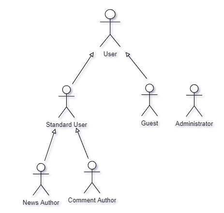

# ER: Requirements Specification

The Super Legit Collaborative News (SLCN) is a project headed by a small group of developers with the main goal of free, open and accessible news sharing for and by users. 

This will allow all users to view and browse the top and most recent news and comments on any topic, with access to text search and category filtering.

# A1: Super Legit Collaborative News (SLCN)

The Super Legit Collaborative News (SLCN) is a project headed by a small group of developers with the main goal of free, open and accessible news sharing for and by users. 

This will allow all users to view and browse the top and most recent news and comments on any topic, with access to text search and category filtering.

On top of that, authenticated users will be able to post news and comments of their own, aswell as vote on any of them.
They will have access to a profile, housing their information, profile picture and reputation. Here will also be a list of posted news and comments, which can be edited and deleted by the author. 
They also will be able to follow other users, specific tags and categories and view their favorite items.
Their reputation will be determined by the number of likes and dislikes on their posts and comments.
The plataform will employ notifications to inform users of every like and comment on a post.

The platform will also employ administrators capable of moderating, editing and deleting posts, comments and user profiles and will be in charge of managing tags and categories.

The platform will have adaptive, responsive design to allow usage on multiple devices (desktop, smartphone, etc) aswell as an intuitive user interface and navigation.

# A2: Actors and User stories
This artifact contains the information and specification of the actors and their user stories.

## 1 Actors
The actors for the Super Legit Collaborative News (SLCN) project are represented in Figure 1 and described in Table 1

    
    <figcaption align = "center">Figure 1: SLCN actors</figcaption>

 

|Identifier| Description|
| --- | --- |
| User | Generic User that can view and search news items and comments |
| Guest | Unauthenticated user that can sign-in or sign-up |
| Standard User| Authenticated user that can also make a new post, comment on a post, vote on a post or comment, has access to a profile, can follow and unfollow users and categories and has a reputation|
| Author | Authenticated standard user that can also edit and delete their posts and comments.|
| Administrator | Authenticated user that is responsible for the moderation of the users and their content. They can edit or delete posts and comments of any user, aswell as their profiles and manage tags and categories|
