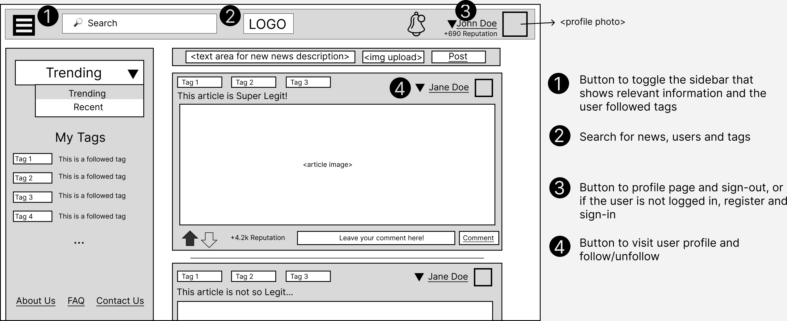

# ER: Requirements Specification

The Super Legit Collaborative News (SLCN) is a project headed by a small group of developers with the main goal of free, open, and accessible news sharing for and by users.

This will allow all users to view and browse all types of news and comments on any topic, with access to text search and tag selection.

# A1: Super Legit Collaborative News (SLCN)

The Super Legit Collaborative News (SLCN) is a project headed by a small group of developers with the main goal of free, open, and accessible news sharing for and by users.

This will allow all users to view and browse all types of news and comments on any topic, with access to text search and tag selection.

On the home page, the users will view the trending or recent news items and be able to search by any news item, user, or tag on the search bar.

The users can register an account on the platform and be able to log in as authenticated users. These users will be able to post news and comments, as well as vote on any of them. They will have access to a profile, housing their personal information, profile picture, and reputation. The reputation is determined by the number of likes and dislikes on their news and comments.

They will also be able to follow or unfollow other users and tags. By following another person, the news they publish will appear on the user's feed. 
The platform will also employ notifications to inform users of every like and comment made on their posts.

Besides the home page, authenticated users will also have access to a profile page. In their profile, the authors have access to a list of their posted news and comments, which they can edit and delete and have a place where they can manage the users they follow and the users following them. Also, they will have options to edit their profile picture and other information.

The platform will also employ administrators capable of moderating, editing, and deleting posts, comments, and user accounts. Administrators will also be in charge of managing tags.

The platform will have an adaptive, responsive design to allow it to work smoothly on multiple devices (desktop, smartphone, etc...) as well as an intuitive user interface and navigation.

# A2: Actors and User stories

This artifact contains the information and specification of the actors and their user stories. It also contains the project's supplementary requirements.

## 1. Actors

The actors for the Super Legit Collaborative News (SLCN) project are represented in Figure 1 and described in Table 1.

    
    <figcaption align = "center">Figure 1: SLCN actors</figcaption>

 

|Identifier| Description|
| --- | --- |
| User | Generic User that can view and search news items and comments. |
| Visitor | Unauthenticated User that can sign-up and sign in |
| Authenticated User| Authenticated user that can make a new post, comment on a post, vote on a post or comment, that has access to a profile with a reputation and that can follow and unfollow users and tags. |
| News Author | Authenticated User that can also edit and delete their news items.|
| Comment Author | Authenticated User that can also edit and delete their comments. |
| Administrator | Authenticated User that is responsible for the moderation of users and content. They can edit or delete posts and comments of any user, as well as their profiles, and can create and manage news tags.|
<figcaption align = "center">Table 1: SLCN actors description</figcaption>

## 2. User Stories

For the SLCN project, the considered user stories are presented below.

 

### 2.1 User

|Identifier | Name| Priority|  Description|
| --- | --- | --- | --- |
| US01 | View Top News Feed | High | As a User, I want to access the top news feed, so that I can view all the most relevant news available. |
| US02 | View News Item | High | As a User, I want to access a single News Item so that I can read a more detailed version of it. |
| US03 | Search | High | As a User, I want to search for a specific tag, comment, or news item so that I can find that information quicker.  |
| US04 | View News Item Comments | Medium | As a User, I want to view the comments of each news item, so that I can know detailed people's opinions about that news item. |
| US05 | View Other Users' Profiles | Medium | As a User, I want to view the profiles of other people, so that I can check their reputation, and news and comment history. |
| US06 | View News Item Tag | Medium | As a User, I want to view which tags the news item belongs to, so that I can quickly know what is it about. |
| US07 | View Recent News Feed | Medium | As a User, I want to sort the news by most recent so I can have access to the newest posts. |
| US08 | About Us | Medium | As a User, I want to have a place where I can read information about the platform and its features so that I can find anything about it. |
| US09 | Contacts | Medium | As a User, I want to have access to the contacts responsible for the platform so that I can ask for information or report issues to the developers. |

<figcaption align = "center">Table 2: User's user stories</figcaption>

 

### 2.2 Visitor

|Identifier | Name| Priority|  Description|
| --- | --- | --- | --- |
| US10 | Sign-in | High | As a Visitor, I want to be able to authenticate so that I can have access to a lot of new features on the platform. |
| US11 | Sign-up | High | As a Visitor, I want to be able to create an account in the system so that I can authenticate and have my profile. |
| US12| Recover Password | Medium | As a Visitor, I want to be able to recover my password, so that I can access my account in case I have forgotten the password for it. |
<figcaption align = "center">Table 3: Visitor's user stories</figcaption>

 

### 2.3 Authenticated User

|Identifier | Name| Priority|  Description|
| --- | --- | --- | --- |
| US13 | Create News Item | High | As an Authenticated User, I want to create and publish a news item, so that it becomes available to other users. |
| US14 | Sign-out | High | As an Authenticated User, I want to sign out from my account, so that I can end the login session. |
| US15 | Edit Profile | High | As an Authenticated User, I want to edit my profile so that I can keep my personal information updated. |
| US16 | View Personal Profile | High | As an Authenticated User, I want to view my user profile so that I can check my post and comment history, and personal information and have an option to edit it. |
| US17 | View User News Feed | High | As an Authenticated User, I want to view a custom news feed so that I can have access to all the news of the people and tags that I am following. |
| US18 | Create a Comment | Medium | As an Authenticated User, I want to create and publish a comment, so that my opinion becomes available to other users. |
| US19 | Vote on News Item | Medium | As an Authenticated User, I want to like or dislike a news item, so that I can declare my opinion on it. |
| US20 | Remove Vote on News Item | Medium | As an Authenticated User, I want to remove my vote on a news item, so that it is removed from the platform. |
| US21 | Vote on Comment | Medium | As an Authenticated User, I want to like or dislike a comment, so that I can declare my opinion on it. |
| US22 | Remove Vote on Comment | Medium | As an Authenticated User, I want to remove my vote on a comment, so that it is removed from the platform. |
| US23 | Delete Account | Medium | As an Authenticated User, I want to be able to delete my account so that I can delete my data from the platform when I stop using it. |
| US24 | Follow Tags | Medium | As an Authenticated User, I want to follow tags so I can choose to view the tags of my best interest. |
| US25 | Unfollow Tags | Medium | As an Authenticated User, I want to unfollow tags so I can stop viewing tags I'm no longer interested in. |
| US26 | Follow Users | Medium | As an Authenticated User, I want to follow other people's profiles so that I can easily access their posts. |
| US27 | Unfollow Users | Medium | As an Authenticated User, I want to unfollow other people's profiles so that I can stop viewing news from people that I'm no longer interested in. |
| US28 | Profile Picture | Medium | As an Authenticated User, I want to edit my profile picture so that others can see who am I when visiting my profile or viewing my news posts and comments. |
| US29 | Answer a Comment | Low | As an Authenticated User, I want to answer other people's comments so that I can comment on other people's points of view. |
| US30 | Save News Item | Low | As an Authenticated User, I want to be able to save a news item so I can keep track of my favorite news. |
| US31 | Apply to an Administrator Account | Low | As an Authenticated User, I want to apply for an Administrator Account so that I can become an administrator. |
| US32 | Report | Low | As an Authenticated User, I want to report to the administrator news items, users, or comments that are not respecting me or others. |
<figcaption align = "center">Table 4: Authenticated User's user stories</figcaption>

 

### 2.4 News Author

|Identifier | Name| Priority|  Description|
| --- | --- | --- | --- |
| US33 | Edit News Item | Medium | As a News Author, I want to edit one of my published articles, so that I can correct/update said article. |
| US34 | Delete News Item | Medium | As a News Author, I want to remove one of my published articles, so that it disappears from the platform. |
| US35 | News Vote Notification | Medium | As a News Author, I want to receive a notification whenever someone votes on a news item I posted so that I'm aware of its popularity. |
| US36 | News Comment Notification | Medium | As a News Author, I want to receive a notification whenever someone comments on one of my news items so that I can read it immediately. |
<figcaption align = "center">Table 5: News Author's user stories</figcaption>

 

### 2.5 Comment Author

|Identifier | Name| Priority|  Description|
| --- | --- | --- | --- |
| US37 | Edit Comment | Medium | As a Comment Author, I want to edit one of my published comments, so that I can correct/update said comment. |
| US38 | Delete Comment | Medium | As a Comment Author, I want to remove one of my published comments, so that it disappears from the platform. |
| US39 | Comment Vote Notification | Medium | As a Comment Author, I want to receive a notification whenever someone votes on a comment I posted so that I'm aware of its popularity. |
<figcaption align = "center">Table 6: Comment Author's user stories</figcaption>

 

### 2.6 Administrator

|Identifier | Name| Priority|  Description|
| --- | --- | --- | --- |
| US40 | Administer User Accounts | High | As an Administrator, I want to search, view, edit and create user accounts so that I can manage them accordingly. |
| US41 | Manage Tags | Medium | As an Administrator, I want to manage tags so that I can add or delete them accordingly. |
| US42 | Manage User Accounts | Medium | As an Administrator, I want to manage user accounts so that the users have access to the platform only when they comply with the guidelines. | 
| US43 | Delete User Account | Medium | As an Administrator, I want to delete user accounts so that if a user in question disobeys the guidelines completely he can't disturb the forums anymore in that account. |
| US44 | Manage Content | Low | As an Administrator, I want to manage users' content so that no forbidden content is on the platform. |
| US45 | Manage User Reports | Low | As an Administrator, I want to manage the reports sent by the users so that I can verify if the reports are disrespecting the guidelines. |
| US46 | Manage Tags Proposals | Low | As an Administrator, I want to manage tag proposals so that I can accept or reject the tags proposed by other users. |
| US47 | Manage Admin applications | Low | As an Administrator, I want to be able to accept or decline admin applications so that I can make sure the admins are a restricted group. |
<figcaption align = "center">Table 7: Administrators's user stories</figcaption>

## 3. Supplementary Requirements

This section contains the business rules, technical requirements, and restrictions of the project.

 

### 3.1 Business Rules

|Identifier | Name| Description|
| --- | --- | --- |
| BR01 | User Reputation | User reputation should be derived from the number of likes and dislikes received by a user on their posts and comments. |
| BR02 | Deleting Posts and Comments | A post or comment cannot be deleted by its author if it has likes or comments. |
| BR03 | Account Deletion | On account deletion, posts, likes, dislikes, and comments should be kept on the platform but marked as anonymous. |
| BR04 | Tag on posts | To post a news item, the author must select at least one tag. |
| BR05 | Vote/Comment on Own Items | A news item or comment author can vote and comment on their items. |
| BR06 | Date of Comments | The date of comments must be after the dates of the news item they are referring to |
<figcaption align = "center">Table 8: Business rules</figcaption>

 

### 3.2 Technical Requirements

|Identifer | Name| Description|
| --- | --- | --- |
| TR01 | Performance | The system should have response times shorter than 2s to ensure the user's attention.|
| TR02 | Robustness | The system must be prepared to handle and continue operating when runtime errors occur. |
| TR03 | Scalability | The system must be prepared to deal with the growth in the number of users and their actions. |
| TR04 | Accessibility | The system must ensure that everyone can access the pages, regardless of whether they have any handicaps or not, or the Web browser they use. |
| **TR05** | **Usability** | **The system should be intuitive and easy to use.   Viewing the project as a collaborative news website, any user should be able to use it regardless of background or experience.** |
| **TR06** | **Database** | **The PostgreSQL database management system must be used.  Considering the news, user information, comments, and votes that are integral to the website as well as their relations to each other, it is important to develop and utilize a robust and well-thought-out database to accommodate those needs.** |
| **TR07** | **Security** | **The system must protect the users' information from unauthorized access as well as employ authentication and verification features.    Since we are working with a platform with user accounts we consider it very important to keep the users' data secure.** |
<figcaption align = "center">Table 9: Technical Requirements</figcaption>

 

### 3.3 Restrictions

| Identifier | Name | Description |
| --- | --- | --- |
| C01 | Deadline | The system should be ready by the week of 02/01/2023 to be submitted for evaluation. |
| C02 | PostgreSQL | The database must be built with the PostgreSQL database system. |
| C03 | Laravel | The Laravel framework must be used to build the site. |
| C04 | Docker | Docker must be used as a virtualization environment. |   
<figcaption align = "center">Table 10: Project Restrictions</figcaption>

# A3: Information Architecture

This artifact serves as an overview of the planned information architecture of the system.

## 1. Sitemap

Our system is built around 5 main areas. The Static Pages provide information about the platform. The News Pages envelop all the news items, news feeds, and news item creations. The Visitor Pages, for logging in and signing up. The Authenticated User Pages, for the user profile, saved news, and report user pages. And the Admin Pages, housing admin-specific pages, and utilities.

    
    <figcaption align = "center">Figure 2: Sitemap</figcaption>

## 2. Wireframes

Below are presented wireframes for the Homepage(UI01), News Item Details page(UI02), and User Profile Page(UI03).

    
    <figcaption align = "center">Figure 3: Homepage(UI01) wireframe</figcaption>

 

    
    <figcaption align = "center">Figure 4: News Item Details(UI02) wireframe</figcaption>

 

    
    <figcaption align = "center">Figure 5: User Profile(UI03) wireframe</figcaption>

# Revisions

First Submission
- A1: Project Description
- A2: Actors and User Stories
- A3: Information Architecture
- Images for actors, sitemap and wireframes
- Group identification

Week 4
- Changed "category/categories" name to "tag/tags" for an easier understanding of this funcionality (although they are interchangeable) and updated the images to reflect this change.

# Team

- André Morais, up202005303@edu.fe.up.pt (editor)
- João Teixeira, up202005437@edu.fe.up.pt (editor)
- Lucas Sousa, up202004682@edu.fe.up.pt (editor)
- Rui Soares, up202103631@edu.fe.up.pt (editor)

#### lbaw2223-t8g6, 04/10/22
